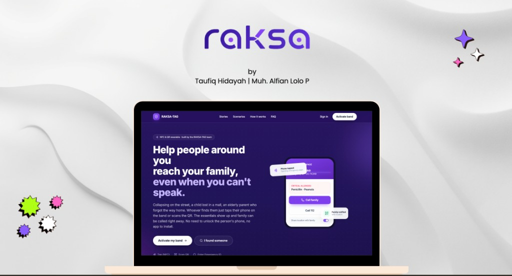

# raksa

<p align="center">
  
</p>

<p align="center">
  <em>by Taufiq Hidayah · Muh. Alfian Lolo P</em>
</p>

Sistem identifikasi darurat berbasis band NFC/QR. Orang di sekitar dapat mengetuk, memindai, atau mencari Emergency ID untuk melihat informasi kritis dan menghubungi keluarga — tanpa login.

Satu akun mengelola banyak band: diri sendiri, anak, atau orang tua lanjut usia.

---

## Fitur utama

| Mode | Skenario | Prioritas halaman publik |
|------|----------|--------------------------|
| **Darurat dewasa** (`adult_emergency`) | Tidak sadar / tidak bisa berkomunikasi | Info medis + kontak darurat |
| **Wali anak** (`child_guardian`) | Anak terpisah di tempat ramai | Telepon orang tua / wali |
| **Orang tua lansia** (`elderly_dependent`) | Bingung, tersesat, atau demensia | Telepon keluarga + konteks medis |

**Akses publik (tanpa login):** NFC · QR · pencarian Emergency ID manual

**Dashboard pemilik:** klaim band, setup profil, kelola keluarga, riwayat pemindaian, nonaktifkan band

---

## Stack

| Lapisan | Teknologi |
|---------|-----------|
| Frontend | Next.js 15 (App Router), React 19, TypeScript, Tailwind CSS 4 |
| Backend | Supabase (PostgreSQL, Auth, RLS) |
| Validasi | Zod |
| Tes | Vitest |
| Arsitektur | Clean Architecture + SOLID — lihat [ARCHITECTURE.md](./ARCHITECTURE.md) |

**Node.js** ≥ 20

---

## Quick start

### 1. Clone & install

```bash
git clone <repo-url>
cd RAKSA
npm install
```

### 2. Environment

```bash
cp .env.example .env.local
```

Isi nilai berikut di `.env.local`:

| Variabel | Keterangan |
|----------|------------|
| `NEXT_PUBLIC_SUPABASE_URL` | URL proyek Supabase |
| `NEXT_PUBLIC_SUPABASE_ANON_KEY` | Anon key (aman untuk client) |
| `SUPABASE_SERVICE_ROLE_KEY` | Service role key (**server only**) |
| `NEXT_PUBLIC_APP_URL` | URL app, mis. `http://localhost:3000` |
| `SUPERADMIN_USER_ID` | UUID user superadmin (opsional) |
| `SUPERADMIN_DISPLAY_NAME` | Nama tampilan di dashboard admin (opsional) |

### 3. Database

Terapkan migrasi dengan [Supabase CLI](https://supabase.com/docs/guides/cli):

```bash
supabase db push
```

Migrasi ada di `supabase/migrations/`:

- `00001_initial_schema` — skema inti
- `00002_rls_policies` — Row Level Security
- `00003_add_device_type` — tipe perangkat (bracelet / necklace / keychain)

### 4. Jalankan

```bash
npm run dev
```

Buka [http://localhost:3000](http://localhost:3000).

---

## Scripts

| Perintah | Deskripsi |
|----------|-----------|
| `npm run dev` | Server development |
| `npm run build` | Build production |
| `npm start` | Jalankan build production |
| `npm run typecheck` | Cek TypeScript |
| `npm run lint` | ESLint |
| `npm test` | Unit test (Vitest) |
| `npm run test:watch` | Vitest watch mode |
| `npm run test:coverage` | Coverage report |

---

## Struktur proyek

```
src/
├── app/                    # Next.js App Router (thin controllers)
│   ├── (marketing)/        # Landing page
│   ├── (public)/           # Halaman darurat publik + lookup
│   ├── (auth)/             # Login & setup
│   ├── (dashboard)/        # Dashboard keluarga
│   ├── (admin)/            # Panel superadmin
│   └── api/                # API routes
├── core/
│   ├── domain/             # Entities, value objects, ports, errors
│   └── application/        # Use cases & DTOs
├── infrastructure/         # Adapter Supabase, auth, mappers
├── presentation/           # Komponen UI & HTTP helpers
└── shared/                 # DI container, config, utilitas

supabase/migrations/        # PostgreSQL + RLS
tests/
├── unit/
├── integration/
└── e2e/
```

**Dependency rule:** ketergantungan mengarah ke dalam. Domain tidak mengenal Next.js atau Supabase.

---

## Alur singkat

```
Ketuk NFC / Scan QR / Lookup Emergency ID
        │
        ▼
  Halaman darurat publik  (/[emergencyId] atau /lookup)
        │
        ├── Info minimum sesuai mode band
        ├── Tombol telepon / WhatsApp
        └── Catat pemindaian (+ notifikasi ke pemilik jika dependen)
```

Pemilik akun: **Login** → **Claim** (Kode Aktivasi) → **Setup profil** → band aktif di dashboard.

---

## Dokumentasi

| Dokumen | Isi |
|---------|-----|
| [product.indonesia.md](./product.indonesia.md) | Spesifikasi produk (ID) |
| [product.english.md](./product.english.md) | Product specification (EN) |
| [ARCHITECTURE.md](./ARCHITECTURE.md) | Clean Architecture, SOLID, use cases |

---

## Lisensi

Private — prototipe kompetisi.
